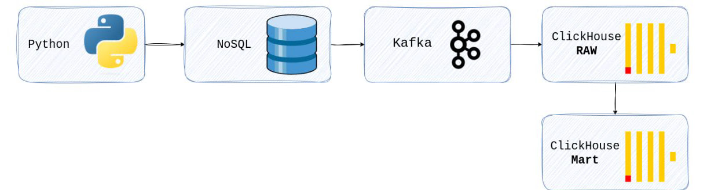

## Pikcha Analytics Project.

<p align="center">
    
</p>

Проект ETL (Extract, Transform, Load) для обработки и анализа данных в реальном времени с использованием современного стека технологий.

### Инфраструктура

- **Docker** - оркестрация сервисов, сети и volume
- **Grafana** - визуализация метрик
- **MongoDB** - источник данных(4 коллекции)
- **Clickhouse** - хранилище:
    - RAW = целый JSON в payload string
    - Kafka таблицы(KafkaEngine) + MV в RAW
    - MART = готовые данные + MV(очистка/валидация/нормализация)
- **Python** - служебные скрипты:
    - generate_data.py = генерация JSON
    - import_json.py = из JSON в MONGO
    - producer.py = из MONGO в Kafka(хэш PII)
- **Grafana** - дашборды и алерты([alertgrfn_bot](t.me/alertgrfn_bot))
- **.env / requirements** - конфигурация окружения и зависимости

### Grafana(алертинг)

- [**Дашборд RAW**](https://github.com/mattim8/pikcha-analytics/blob/main/scripts/data/gr_dashboard.png)
- [**Алертинг в тг бота**](https://github.com/mattim8/pikcha-analytics/blob/main/sql/tgbot_screen.jpg)
- [**Алертинг дубликатов в Grafana**](https://github.com/mattim8/pikcha-analytics/blob/main/sql/grafalert_scr.jpg)

### Запуск

1. Клонируйте репозиторий:
```bash
git clone https://github.com/mattim8/pikcha-analytics.git
cd pikcha-analytics
```

2. Создайте файл `.env` со следующими параметрами на основе [.env.example](https://github.com/mattim8/pikcha-analytics/blob/main/.env.example)

3. Запускаем:
``` bash
docker compose up -d
```

4. Используйте [requirements.txt](https://github.com/mattim8/pikcha-analytics/blob/main/requirements.txt)
```bash
pip install -r requirements.txt
``` 

5. Скрипты:
```bash
python scripts/generate_data.py
```

```bash
python scripts/import_json.py
```

```bash
python scripts/producer.py
```

6. Проверяем количество строк ClickHouse RAW:
```bash
docker compose exec clickhouse clickhouse-client -u user --password strongpassword \
  -q "SELECT count() FROM piccha_raw.purchases_raw"
```

7. Проверяем количество чистых покупок ClickHouse MART:
```bash
docker compose exec clickhouse clickhouse-client -u user --password strongpassword \
  -q "SELECT count() FROM piccha_mart.purchases_clean"
```